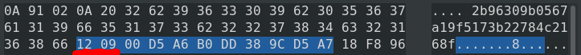

# Java, BigInteger, Protobuffers, C
A small note on working with BigInteger byte array and String representation, Google protobuffers and deserialization in something else than Java.

## Old String representation serialized as string

A number suitable for BigInteger, i.e. unsigned 64 bit int, represented as Java String:

    "crc64Hash":"15395186840396682663"

Used to be serialized as string to the protobuffer and that is definitely quite suboptimal to say the least.

    optional string crc64Hash = 2;

Old serialization to Protobuffers:

    - writer.writeString("crc64Hash", record.getCrc64Hash());

Result:

<a href="biginteger_as_string.png" target="blank"></a>

## New BigInteger representation serialized as byte array

Infinitely better for interoperability is to keep the representation as BigInteger and to serialize it as a byte array:

    optional bytes crc64Hash = 2;

New serialization to Protobuffers:

    + writer.writeBytes("crc64Hash", record.getCrc64Hash().toByteArray());

Result:

<a href="biginteger_as_bytearray.png" target="blank"></a>

Note the ```12 09``` underscored in red &#x1F534;. According to the encoder [documentation](https://developers.google.com/protocol-buffers/docs/encoding#strings), ```12```, represents 0x12 → field number = 2, type = 2. See that aforementioned crc64Hash field is indeed numbered 2. ```09``` marks the number of bytes to follow, i.e 9 bytes.

## Deserialization

One can yank these bytes out and use them to form unsigned long:

```c
#include <stdio.h>

void main() {
    unsigned long hexaToLong;
    sscanf("00D5A6B0DD389CD5A7","%lX", &hexaToLong);
    printf("hexa to long: %lu\n", hexaToLong);
    unsigned long longToHexa = 15395186840396682663UL;
    printf("long to hexa: %lX\n", longToHexa);
}
```

Output:

    hexa to long: 15395186840396682663
    long to hexa: D5A6B0DD389CD5A7

## Byte array length varies

BigInteger uses as few bits to store a number as possible. It used 64 bits plus sign to store the aforementioned ```15395186840396682663```, so it consumed 9 bytes.

See an example with a smaller number: ```1625639120484488996```, Java BigInteger needs 61 bits plus sign to store it, so it consumes 8 bytes.

<a href="biginteger_as_bytearray_smaller.png" target="blank"></a>
